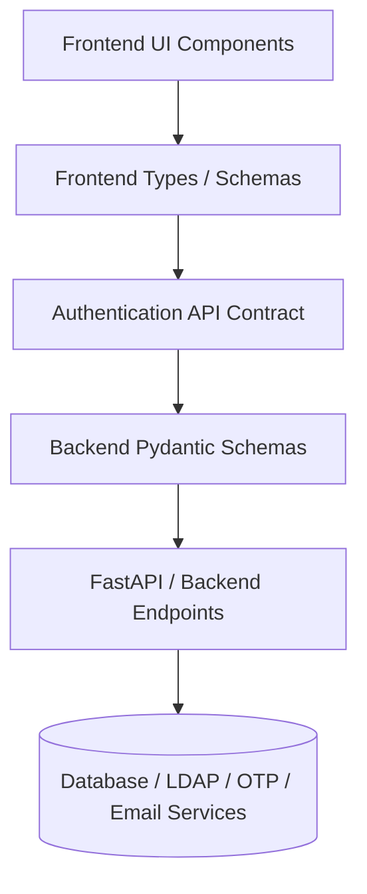

# KRIYA Authentication API Contract

This document defines the formal REST API contract for the **KRIYA Sovereign Industrial AI Workbench** authentication system.

> **Implementation Boundary**: This specification defines endpoints, request bodies, response payloads, status codes, and security invariants. It decouples the frontend client from the backend implementation.

---

## 🏛️ Architecture Overview



### Security & Design Invariants
1. **Zero Secret Leakage**: Passwords and raw OTP values are **never** returned in any response, log, or client-facing object.
2. **Backend is Single Source of Truth**:
   - Company email is resolved solely by the backend from the `employeeId`. The client cannot specify or override the destination email.
   - Designation, department, operational site, and access permissions are backend-controlled.
   - OTP generation, dispatch, expiration, and verification occur exclusively on the backend.
3. **Multi-Step Token Isolation**:
   - Registration Step 3 produces a temporary, cryptographically signed `verificationToken` strictly required to authorize Step 4 (`set-password`).
   - Login Step 1 produces a temporary `verificationId` bound to the employee session to verify the 2FA OTP in Step 2.
4. **Identifier Flexibility**: Login permits either corporate `employeeId` (e.g., `EMP-7291`) or company `email` (e.g., `engineer@mrpl.co.in`). Neither is mandated to the exclusion of the other.

---

## 📋 Endpoints Summary

| Flow | Step | Method | Path | Description |
|---|---|---|---|---|
| **Registration** | 1 | `POST` | `/auth/register/employee` | Validate Employee ID & fetch read-only corporate directory details |
| **Registration** | 2 | `POST` | `/auth/register/send-otp` | Trigger generation and dispatch of registration OTP to registered email |
| **Registration** | 3 | `POST` | `/auth/register/verify-otp` | Validate 6-digit registration OTP & obtain `verificationToken` |
| **Registration** | 4 | `POST` | `/auth/register/set-password` | Set enterprise password & activate account credentials |
| **Login** | 1 | `POST` | `/auth/login` | Verify credentials (ID/Email + Password) & initiate 2FA OTP |
| **Login** | 2 | `POST` | `/auth/login/verify-otp` | Validate 2FA OTP & complete authentication (returns token & permissions) |

---

## 🔄 Flow 1: New Employee Registration

### Step 1: Fetch & Verify Employee Directory Information

Checks whether the Employee ID exists in the corporate directory, confirms they are eligible for onboarding, and returns their directory information to populate the read-only profile card.

* **Endpoint**: `POST /auth/register/employee`
* **Authentication**: None (Public)
* **Headers**: `Content-Type: application/json`

#### Request Body
```json
{
  "employeeId": "EMP-8942"
}
```
| Field | Type | Required | Description |
|---|---|---|---|
| `employeeId` | `string` | **Yes** | Corporate employee identifier assigned by organization |

#### Success Response (`200 OK`)
```json
{
  "employee": {
    "employeeId": "EMP-8942",
    "employeeName": "Aarav Sharma",
    "companyEmail": "aarav.sharma@kriya-energy.com",
    "designation": "Senior Process Engineer",
    "department": "Crude Distillation Unit (CDU-II)",
    "operationalSite": "Refinery Complex Alpha (Sector 4)"
  },
  "alreadyRegistered": false,
  "message": "Employee record found in corporate directory."
}
```

#### Error Responses
* `404 Not Found`: Employee ID does not exist.
  ```json
  {
    "error": {
      "code": "EMPLOYEE_NOT_FOUND",
      "message": "The specified Employee ID was not found in the corporate directory."
    }
  }
  ```
* `409 Conflict`: Employee has already registered an account.
  ```json
  {
    "error": {
      "code": "EMPLOYEE_ALREADY_REGISTERED",
      "message": "This Employee ID is already registered. Please sign in instead."
    }
  }
  ```

---

### Step 2: Send Registration OTP

Requests the backend to generate a cryptographically random 6-digit OTP and dispatch it to the employee's registered corporate email.

* **Endpoint**: `POST /auth/register/send-otp`
* **Authentication**: None (Public)
* **Headers**: `Content-Type: application/json`

#### Request Body
```json
{
  "employeeId": "EMP-8942"
}
```
| Field | Type | Required | Description |
|---|---|---|---|
| `employeeId` | `string` | **Yes** | Corporate employee identifier |

#### Success Response (`200 OK`)
```json
{
  "otpSent": true,
  "maskedEmail": "aa***ma@kriya-energy.com",
  "expiresInSeconds": 300,
  "message": "Verification code sent to registered company email."
}
```

#### Error Responses
* `429 Too Many Requests`: Rate limit exceeded for OTP generation.
  ```json
  {
    "error": {
      "code": "OTP_LIMIT_EXCEEDED",
      "message": "Too many OTP requests. Please wait 2 minutes before requesting a new code."
    }
  }
  ```
* `404 Not Found`: Employee ID not found.

---

### Step 3: Verify Registration OTP

Validates the 6-digit OTP entered by the employee. Upon successful verification, returns a temporary one-time `verificationToken` required to proceed to Step 4.

* **Endpoint**: `POST /auth/register/verify-otp`
* **Authentication**: None (Public)
* **Headers**: `Content-Type: application/json`

#### Request Body
```json
{
  "employeeId": "EMP-8942",
  "otp": "492018"
}
```
| Field | Type | Required | Description |
|---|---|---|---|
| `employeeId` | `string` | **Yes** | Corporate employee identifier |
| `otp` | `string` | **Yes** | 6-digit numeric OTP entered by the user |

#### Success Response (`200 OK`)
```json
{
  "verified": true,
  "verificationToken": "reg_vtok_8f9c1e2d3b4a567890abcdef123456",
  "message": "Email verified successfully. Proceed to password creation."
}
```

#### Error Responses
* `400 Bad Request`: Invalid OTP format or incorrect OTP value.
  ```json
  {
    "error": {
      "code": "INVALID_OTP",
      "message": "The verification code entered is incorrect."
    }
  }
  ```
* `410 Gone`: OTP has expired.
  ```json
  {
    "error": {
      "code": "OTP_EXPIRED",
      "message": "The verification code has expired. Please request a new code."
    }
  }
  ```

---

### Step 4: Set Enterprise Password

Sets the user's account password and activates the account. Requires the `verificationToken` issued in Step 3.

* **Endpoint**: `POST /auth/register/set-password`
* **Authentication**: Token-verified via `verificationToken`
* **Headers**: `Content-Type: application/json`

#### Request Body
```json
{
  "employeeId": "EMP-8942",
  "password": "SecurePassword#2026",
  "verificationToken": "reg_vtok_8f9c1e2d3b4a567890abcdef123456"
}
```
| Field | Type | Required | Description |
|---|---|---|---|
| `employeeId` | `string` | **Yes** | Corporate employee identifier |
| `password` | `string` | **Yes** | New enterprise password |
| `verificationToken` | `string` | **Yes** | Temporary token obtained from Step 3 OTP verification |

#### Success Response (`201 Created`)
```json
{
  "success": true,
  "message": "Password configured successfully. Your account is now active."
}
```

#### Error Responses
* `400 Bad Request`: Password does not meet security policies.
  ```json
  {
    "error": {
      "code": "PASSWORD_POLICY_VIOLATION",
      "message": "Password must be at least 8 characters with 1 uppercase, 1 digit, and 1 special symbol."
    }
  }
  ```
* `401 Unauthorized`: Invalid, tampered, or expired `verificationToken`.
  ```json
  {
    "error": {
      "code": "INVALID_VERIFICATION_TOKEN",
      "message": "Registration session has expired or is invalid. Please restart verification."
    }
  }
  ```

---

## 🔐 Flow 2: Existing Employee Login

### Step 1: Submit Credentials & Initiate 2FA

Validates primary credentials (Employee ID or Company Email + Enterprise Password). If valid, the backend automatically dispatches a 2FA OTP to the employee's registered company email and returns a temporary `verificationId`.

* **Endpoint**: `POST /auth/login`
* **Authentication**: None (Public)
* **Headers**: `Content-Type: application/json`

#### Request Body (Option A: Using Employee ID)
```json
{
  "employeeId": "EMP-7291",
  "password": "EnterprisePassword#2026"
}
```

#### Request Body (Option B: Using Company Email)
```json
{
  "email": "engineer@mrpl.co.in",
  "password": "EnterprisePassword#2026"
}
```
| Field | Type | Required | Description |
|---|---|---|---|
| `employeeId` | `string` | **Optional\*** | Corporate employee ID (\*Either `employeeId` or `email` must be provided) |
| `email` | `string` | **Optional\*** | Corporate company email (\*Either `employeeId` or `email` must be provided) |
| `password` | `string` | **Yes** | Employee's account password |

#### Success Response (`200 OK`)
```json
{
  "credentialsValid": true,
  "otpInitiated": true,
  "verificationId": "login_vref_3a7b9c1d5e2f408891abbcddee001122",
  "maskedEmail": "en***er@mrpl.co.in",
  "expiresInSeconds": 300,
  "message": "Primary credentials valid. Security code dispatched to registered email."
}
```

#### Error Responses
* `401 Unauthorized`: Invalid employee ID, email, or password.
  ```json
  {
    "error": {
      "code": "INVALID_CREDENTIALS",
      "message": "Invalid employee credentials provided."
    }
  }
  ```
* `403 Forbidden`: Account locked or ineligible for sovereign access.
  ```json
  {
    "error": {
      "code": "ACCOUNT_LOCKED_OR_INELIGIBLE",
      "message": "This account is inactive or restricted from sovereign AI access."
    }
  }
  ```

---

### Step 2 & 3: Verify Login 2FA OTP & Finalize Session

Verifies the 2FA OTP against the `verificationId` issued in Step 1. Returns the session access token, authenticated employee directory information, and backend-determined access permissions.

* **Endpoint**: `POST /auth/login/verify-otp`
* **Authentication**: None (Public, bound by `verificationId`)
* **Headers**: `Content-Type: application/json`

#### Request Body
```json
{
  "verificationId": "login_vref_3a7b9c1d5e2f408891abbcddee001122",
  "otp": "839214"
}
```
| Field | Type | Required | Description |
|---|---|---|---|
| `verificationId` | `string` | **Yes** | Temporary verification session ID from Step 1 |
| `otp` | `string` | **Yes** | 6-digit numeric security code |

#### Success Response (`200 OK`)
```json
{
  "authenticated": true,
  "accessToken": "kriya_sec_token_9f8e7d6c5b4a3120...",
  "tokenType": "Bearer",
  "expiresIn": 86400,
  "employee": {
    "employeeId": "EMP-7291",
    "employeeName": "Rajesh Nair",
    "companyEmail": "engineer@mrpl.co.in",
    "designation": "Lead Plant Operations Engineer",
    "department": "Crude Distillation & Vacuum Units (CDU/VDU)",
    "operationalSite": "Mangalore Refinery Complex (Site-B)"
  },
  "access": {
    "level": "lead_engineer",
    "permissions": [
      "chat:standard",
      "chat:reasoning",
      "tools:read_telemetry",
      "tools:simulate_process",
      "schematics:view_p_and_id"
    ]
  },
  "message": "Authentication successful. Welcome to KRIYA Sovereign AI."
}
```

#### Error Responses
* `400 Bad Request`: Incorrect OTP.
  ```json
  {
    "error": {
      "code": "INVALID_OTP",
      "message": "Invalid security code."
    }
  }
  ```
* `410 Gone`: Login verification session expired.
  ```json
  {
    "error": {
      "code": "OTP_EXPIRED",
      "message": "Login verification session has expired. Please sign in again."
    }
  }
  ```

---

## 🛡️ Standardized Error Contract

All error responses strictly follow the standard JSON error envelope:

```json
{
  "error": {
    "code": "<STANDARDIZED_ERROR_CODE>",
    "message": "<Safe, clear, non-leaking user-facing message>"
  }
}
```

### Error Codes Registry

| Error Code | HTTP Status | Meaning |
|---|---|---|
| `EMPLOYEE_NOT_FOUND` | `404` | Employee ID is not present in the corporate directory |
| `EMPLOYEE_ALREADY_REGISTERED` | `409` | Employee already has an active account |
| `INVALID_IDENTIFIER` | `400` | Malformed Employee ID or email format |
| `INVALID_CREDENTIALS` | `401` | Incorrect ID/email or password combination |
| `OTP_EXPIRED` | `410` | 6-digit verification code validity window exceeded |
| `INVALID_OTP` | `400` | Code does not match the active dispatched OTP |
| `OTP_LIMIT_EXCEEDED` | `429` | Excessive OTP generation attempts triggered rate limit |
| `REGISTRATION_VERIFICATION_FAILED`| `400` | Employee verification prerequisites unmet |
| `INVALID_VERIFICATION_TOKEN` | `401` | Password setup token is invalid, expired, or tampered |
| `PASSWORD_POLICY_VIOLATION` | `400` | Password failed enterprise complexity rules |
| `PASSWORD_SETUP_FAILED` | `500` | Internal error while provisioning credentials |
| `AUTHENTICATION_FAILED` | `401` | General authentication failure |
| `ACCOUNT_LOCKED_OR_INELIGIBLE` | `403` | Employee account suspended, locked, or restricted |
| `INTERNAL_SERVER_ERROR` | `500` | Unhandled internal server failure |

---

## 🔗 Frontend TypeScript Mapping Reference

| API Contract Request / Response | TypeScript Interface in [`auth_api.ts`](file:///v:/SIH/KRIYA/frontend/src/api/auth_api.ts) |
|---|---|
| Directory Record | `Employee` (from [`employee.ts`](file:///v:/SIH/KRIYA/frontend/src/schemas/employee.ts)) |
| Step 1 Request | `FetchEmployeeDetailsRequest` |
| Step 1 Response | `FetchEmployeeDetailsResponse` |
| Step 2 Request | `SendRegistrationOtpRequest` |
| Step 2 Response | `SendRegistrationOtpResponse` |
| Step 3 Request | `VerifyRegistrationOtpRequest` |
| Step 3 Response | `VerifyRegistrationOtpResponse` |
| Step 4 Request | `SetRegistrationPasswordRequest` |
| Step 4 Response | `SetRegistrationPasswordResponse` |
| Login Step 1 Request | `LoginCredentialsRequest` |
| Login Step 1 Response | `LoginCredentialsResponse` |
| Login Step 2 Request | `VerifyLoginOtpRequest` |
| Login Step 2 Response | `VerifyLoginOtpResponse` |
| Access Control Model | `SafeEmployeeAccess` |
| Standard Error Model | `AuthErrorResponse` & `AuthErrorDetail` |
| Error Code Registry | `AuthErrorCode` |
