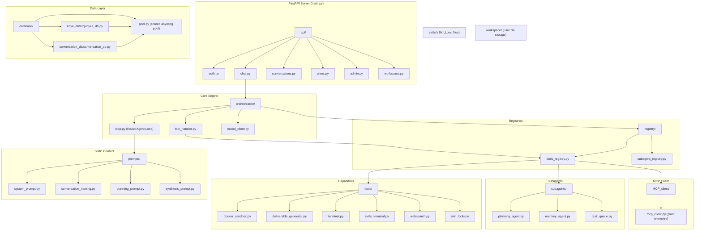

# KRIYA Backend Refactoring — Implementation Plan

## Goal
Restructure the entire KRIYA backend from its current patched state into a clean, modular architecture with 10 clearly defined subsystems. Preserve all working functionality (auth, conversations, orchestration, deliverables, planning, sandbox) while eliminating dead code, circular imports, duplicated schemas, and scattered prompts.

---

## User Review Required

> [!IMPORTANT]
> **Docker Sandbox Image**: Your plan says tools must execute inside Docker. Currently, the sandbox checks for `kriya-sandbox:latest` and falls back to subprocess. Do you want me to create a `Dockerfile` for `kriya-sandbox` during this refactoring, or will you handle the Docker image separately?

> [!IMPORTANT]
> **Skills Terminal Isolation**: You specified the agent should have a "separate terminal tool" restricted to the skills directory running inside Docker. This is a new tool that doesn't exist yet. I'll implement it as `skills_terminal.py` — a lightweight tool that runs `docker exec` commands scoped to a bind-mounted skills volume. Confirm this approach is acceptable.

> [!IMPORTANT]
> **Company Routes Removal**: The current `company_routes.py` and `refinery_tools.py` query a local simulated refinery database (`refinery_db.py`). Since the RPi agent is now handling all company infrastructure, should I **remove** these files entirely, or keep them as stubs that route to the RPi's MCP?

> [!WARNING]
> **Database Pool Duplication**: Currently `employee_db.py` and `conversation_db.py` each create their own independent `asyncpg.Pool`. This wastes connections and can cause pool exhaustion. I will consolidate them into a single shared pool in `database/pool.py`. This is a structural change — confirm you're OK with it.

---

## Open Questions

> [!IMPORTANT]
> **Memory Agent**: The current `memory_agent.py` imports from `backend.database.memories.*` which has its own PostgreSQL tables. Should this subsystem be preserved as-is, removed, or moved to the RPi?

> [!IMPORTANT]
> **Web Search Tool**: `websearch.py` uses DuckDuckGo which violates air-gap. Should I keep it as a gated tool (requiring approval) or remove it entirely?

---

## Architecture Overview



---

## Proposed Changes

### 1. Prompts — Extract All Inline Prompts
*Every prompt string currently embedded inside Python files will be extracted into `backend/prompts/`.*

#### [NEW] `backend/prompts/system_prompt.py`
Already exists. Will be preserved as-is with the main `SYSTEM_PROMPT`.

#### [NEW] `backend/prompts/conversation_naming.py`
Extract `CONVERSATION_NAMING_SYSTEM_PROMPT` from `system_prompts.py` (already there) — just rename file for clarity.

#### [NEW] `backend/prompts/planning_prompt.py`
Extract the 56-line `PLANNING_AGENT_SYSTEM_PROMPT` currently hardcoded at the top of `subagents/planning_agent.py` (lines 17-57).

#### [NEW] `backend/prompts/synthesis_prompt.py`
Extract the "Mandatory Final Synthesis" user message currently hardcoded in `orchestration/loop.py` (lines 289-295):
```python
FINAL_SYNTHESIS_PROMPT = (
    "Execution phase is complete. All necessary tool actions, database queries, "
    "and calculations have concluded. Provide your complete, comprehensive final "
    "engineering report for the plant operator..."
)
```

#### [DELETE] `backend/prompts/__init__.py`
Empty file, not needed.

#### [DELETE] `backend/prompts/system_prompts/` (old subfolder)
Old folder structure, already consolidated into `system_prompts.py`.

---

### 2. Database — Consolidate Connection Pools

#### [NEW] `backend/database/pool.py`
Single shared asyncpg pool used by both `employee_db.py` and `conversation_db.py`:
```python
import os, asyncio, asyncpg
from pathlib import Path
from dotenv import load_dotenv

env_path = Path(__file__).resolve().parent.parent.parent / ".env"
load_dotenv(dotenv_path=env_path)

_pool = None

async def get_db_pool() -> asyncpg.Pool:
    global _pool
    current_loop = asyncio.get_running_loop()
    if _pool is None or getattr(_pool, "_closed", False):
        db_url = os.getenv("DATABASE_URL")
        _pool = await asyncpg.create_pool(db_url, min_size=1, max_size=10)
    return _pool
```

#### [MODIFY] `backend/database/kriya_db/employee_db.py`
- Remove the local `get_db_pool()` function and its `_pool` global.
- Add `from backend.database.pool import get_db_pool` at the top.
- Remove the duplicate `CREATE_EMPLOYEES_TABLE_SQL` and Pydantic schemas that are also defined in `schema/employee.py` (the schemas now live directly in `api/auth.py` per the new architecture).
- Keep all query functions (`get_employee_by_id`, `generate_and_store_otp`, `verify_login_otp`, `set_employee_password`, `list_all_employees_admin`, `enroll_new_employee`, etc.) and the `SEED_EMPLOYEES` list.
- Move `CREATE_EMPLOYEES_TABLE_SQL` to a constant at the top of this file (remove import from deleted schema file).
- Keep `init_employee_db()`, `hash_password()`, `verify_password()`, `mask_email()`.

#### [MODIFY] `backend/database/conversation_db/conversation_db.py`
- Remove the local `get_db_pool()` function and its `_pool` global.
- Add `from backend.database.pool import get_db_pool` at the top.
- Remove the duplicate `CREATE_CONVERSATIONS_TABLE_SQL` and Pydantic schemas.
- Move `CREATE_CONVERSATIONS_TABLE_SQL` to a constant at the top.
- Keep all query functions as-is.

#### [DELETE] `backend/database/kriya_db/schema/` (entire folder)
Schemas will live in the API files per user's architecture requirements.

#### [DELETE] `backend/database/company/` (entire folder)
Company data is now on the RPi. The MCP client handles communication.

#### [DELETE] `backend/database/memories/` (entire folder, pending user confirmation)
If memory subsystem stays, it also uses `pool.py`.

#### [DELETE] `backend/schemas/` (entire folder)
- `model_request.py` → moved into `orchestration/model_client.py`
- `conversation.py` → schemas moved into `api/conversations.py`
- `webchat.py` → schemas moved into `api/chat.py`

---

### 3. API — One File Per Endpoint, Schemas Inline

#### [MODIFY] `backend/api/auth.py` (rename from `auth_routes.py`)
- Contains all auth FastAPI routes.
- Contains all auth Pydantic schemas (`FetchEmployeeRequest`, `LoginCredentialsRequest`, `VerifyLoginOtpRequest`, etc.) directly below the routes.
- Imports query functions from `database/kriya_db/employee_db.py`.
- Fix the orphaned indentation errors identified by the research agents.

#### [MODIFY] `backend/api/chat.py` (rename from `webchat_routes.py`)
- Contains `/api/chat/stream` and `/api/chat` routes.
- Contains `WebChatRequest` and `WebChatResponse` schemas inline.
- Imports `run_agent_loop_stream` directly from `orchestration/loop.py` (eliminates the circular import through `orchestration/main.py`).

#### [MODIFY] `backend/api/conversations.py` (rename from `conversation_routes.py`)
- Contains all conversation CRUD routes.
- Contains `ConversationListItem`, `ConversationDetail`, `AppendExchangeRequest`, `GenerateTitleRequest`, `GenerateTitleResponse` schemas inline.
- Imports from `database/conversation_db/conversation_db.py`.

#### [MODIFY] `backend/api/plans.py` (rename from `plan_routes.py`)
- Contains all plan/approval routes.
- Contains `CreatePlanRequest`, `UpdatePlanRequest`, `ResolveApprovalRequest` schemas inline.

#### [MODIFY] `backend/api/admin.py` (rename from `admin_routes.py`)
- Contains admin employee management routes.
- Contains `EnrollEmployeeRequest` schema inline (fixes the missing import bug).

#### [MODIFY] `backend/api/workspace.py` (rename from `workspace_routes.py`)
- Contains deliverables listing and download routes.
- Correctly scans `documents/`, `media/`, `sandbox/` subdirectories.

#### [MODIFY] `backend/api/session.py`
- Stays as-is. Contains JWT validation dependency.

#### [DELETE] `backend/api/company_routes.py`
Company data is on the RPi now. MCP client handles it.

#### [DELETE] `backend/api/model_client.py`
Moved to `orchestration/model_client.py` where it belongs.

---

### 4. Orchestration — Centralized Agent Engine

#### [MODIFY] `backend/orchestration/model_client.py` (moved from `api/model_client.py`)
- Contains `ModelRequest`, `ChatMessage`, `ToolDefinition`, `FunctionDefinition` Pydantic models.
- Contains `get_openai_client()`, `get_async_openai_client()`, `send_async_chat_request()`, `stream_chat_request()`.
- Fix orphaned indentation errors.

#### [MODIFY] `backend/orchestration/loop.py`
- Import `SYSTEM_PROMPT` from `backend.prompts.system_prompt`.
- Import `FINAL_SYNTHESIS_PROMPT` from `backend.prompts.synthesis_prompt`.
- Remove the orphaned prompt text at lines 25-39.
- Remove the entire "Automated Deliverable Synthesis Safety Net" section (lines 374-420). This was a hack that's no longer needed with proper schema enforcement.
- Keep the core `run_agent_loop_stream()` and `run_agent_loop()` functions.

#### [MODIFY] `backend/orchestration/tool_handler.py`
- Stays mostly as-is. Already clean.

#### [DELETE] `backend/orchestration/main.py`
- This was a thin wrapper to avoid circular imports. With `WebChatRequest` defined in `api/chat.py` and the loop imported directly, this indirection is unnecessary.

---

### 5. Tools — Function + Schema Together

#### [MODIFY] `backend/tools/docker_sandbox.py`
- Update import: `from backend.workspace.workspace_manager import ...`
- Already has `SANDBOX_TOOL_SCHEMA` co-located. ✅

#### [MODIFY] `backend/tools/deliverable_generator.py`
- Update import: `from backend.workspace.workspace_manager import ...`
- Already has `DOCX_TOOL_SCHEMA`, `XLSX_TOOL_SCHEMA`, `PPTX_TOOL_SCHEMA`, `VERIFY_CONSISTENCY_SCHEMA` co-located. ✅

#### [MODIFY] `backend/tools/terminal.py`
- Already has `TERMINAL_TOOL_SCHEMA` co-located. ✅

#### [MODIFY] `backend/tools/skill_tools.py`
- Update `SKILLS_DIR` to point to `backend/skills/` instead of `workbench/skills/`.
- Already has schemas co-located. ✅

#### [NEW] `backend/tools/skills_terminal.py`
New tool for isolated Docker terminal access to the skills directory:
```python
def run_skills_terminal(command: str) -> str:
    """Executes a command inside a Docker container with only the skills
    directory mounted. The agent can read, write, and create files
    inside the skills folder but cannot access the host filesystem."""
    ...

SKILLS_TERMINAL_SCHEMA = { ... }
```

#### [MODIFY] `backend/tools/websearch.py`
- Already has `WEBSEARCH_TOOL_SCHEMA` co-located. ✅

#### [DELETE] `backend/tools/refinery_tools.py`
Company-side tools moved to RPi. MCP client handles this.

---

### 6. Subagents — Treated Like Tools

#### [MODIFY] `backend/subagents/planning_agent.py`
- Extract `PLANNING_AGENT_SYSTEM_PROMPT` to `prompts/planning_prompt.py`.
- Import it from there.
- Keep `generate_plan()`, `generate_plan_async()`, `generate_dynamic_plan()`.

#### [MODIFY] `backend/subagents/memory_agent.py`
- Keep as-is if memory subsystem is preserved.
- Already has `STORE_MEMORY_SCHEMA` and `RETRIEVE_MEMORY_SCHEMA` co-located. ✅

#### [MODIFY] `backend/subagents/task_queue.py`
- Already clean. Keep as-is.

---

### 7. Registry — Two Files Only

#### [MODIFY] `backend/registry/tools_registry.py`
- Remove imports for deleted modules (`refinery_tools`).
- Add import for new `skills_terminal.py`.
- Keep `TOOLS_MAP`, `TOOLS_SCHEMA`, and `execute_tool()`.

#### [MODIFY] `backend/registry/subagent_registry.py` (rename from `sub-agent-registry.py`)
Rename to use underscores (Python module convention — hyphens break imports).
- Remove imports for deleted modules.
- Keep `AGENTS_REGISTRY`, `get_subagent()`, `list_registered_subagents()`.

---

### 8. MCP Client — Plug-and-Play

#### [MODIFY] `backend/MCP_client/mcp_client.py`
- Already exists and is clean.
- Remove the local fallback `from mcps.server import ...` (that server is now on the RPi).
- Keep `fetch_from_mcp_server()`, `get_live_mcp_telemetry()`, `get_all_mcp_units_status()`.
- Keep schemas co-located. ✅

---

### 9. Skills — Move to Backend

#### [MODIFY] `backend/skills/`
Skills are already at `backend/skills/skills/`. Flatten this to:
```
backend/skills/
├── code-sandbox/
│   └── SKILL.md
├── inspection-report/
│   └── SKILL.md
├── management-presentation/
│   └── SKILL.md
└── pid-inspection/
    └── SKILL.md
```

#### [DELETE] `workbench/skills/` (old location)
Moved to `backend/skills/`.

---

### 10. Workspace — Already Correct

#### `backend/workspace/workspace_manager.py`
- Already in the right place with `ContextVar` scoping, `get_file_category()`, and `set_active_workspace()`. ✅
- No changes needed.

---

### 11. Entry Points & Cleanup

#### [MODIFY] `backend/main.py`
- Update router imports to new filenames (`auth`, `chat`, `conversations`, `plans`, `admin`, `workspace`).
- Remove `company_router` import.

#### [MODIFY] `backend/run_backend.py`
- Remove MCP auto-spawn logic (MCP is now on the RPi).
- Keep Uvicorn launch config.

#### [DELETE] Root-level consolidation scripts
- `consolidate_api.py`
- `consolidate_db.py`
- `consolidate_model_request.py`
These were one-time migration helpers.

#### [DELETE] `codebase_tree.txt`
Generated artifact, not source code.

#### [DELETE] Old `__pycache__` directories
Clean build artifacts.

---

## Final Directory Structure

```
backend/
├── main.py                          # FastAPI app factory + CORS + router mounts
├── run_backend.py                   # Uvicorn launcher
├── api/
│   ├── auth.py                      # Auth routes + auth schemas
│   ├── chat.py                      # Chat stream/non-stream + WebChatRequest/Response
│   ├── conversations.py             # CRUD conversations + conversation schemas
│   ├── plans.py                     # Plan/approval routes + plan schemas
│   ├── admin.py                     # Admin employee management + admin schemas
│   ├── workspace.py                 # Deliverables listing/download
│   └── session.py                   # JWT validation dependency
├── orchestration/
│   ├── loop.py                      # ReAct multi-step agent loop
│   ├── tool_handler.py              # Tool call parser + executor
│   └── model_client.py              # OpenAI client + ModelRequest + streaming
├── prompts/
│   ├── system_prompt.py             # Main KRIYA system prompt
│   ├── conversation_naming.py       # Title generation prompt
│   ├── planning_prompt.py           # Planning agent system prompt
│   └── synthesis_prompt.py          # Final synthesis user prompt
├── registry/
│   ├── tools_registry.py            # TOOLS_MAP + TOOLS_SCHEMA + execute_tool()
│   └── subagent_registry.py         # AGENTS_REGISTRY + getters
├── tools/
│   ├── docker_sandbox.py            # Code execution in Docker/subprocess
│   ├── deliverable_generator.py     # DOCX/XLSX/PPTX generation
│   ├── terminal.py                  # Host terminal command execution
│   ├── skills_terminal.py           # Docker-isolated skills directory terminal
│   ├── skill_tools.py               # Skill discovery + loading
│   └── websearch.py                 # DuckDuckGo (gated)
├── subagents/
│   ├── planning_agent.py            # Plan generation (LLM + dynamic fallback)
│   ├── memory_agent.py              # Memory store/retrieve (2-agent pipeline)
│   └── task_queue.py                # Plan state machine + approval engine
├── MCP_client/
│   └── mcp_client.py                # Remote MCP HTTP client + schemas
├── skills/
│   ├── code-sandbox/SKILL.md
│   ├── inspection-report/SKILL.md
│   ├── management-presentation/SKILL.md
│   └── pid-inspection/SKILL.md
├── workspace/
│   └── workspace_manager.py         # ContextVar scoped workspace isolation
└── database/
    ├── pool.py                      # Shared asyncpg connection pool
    ├── kriya_db/
    │   └── employee_db.py           # Auth queries + seed data + OTP + sessions
    └── conversation_db/
        └── conversation_db.py       # Conversation CRUD queries
```

---

## Verification Plan

### Automated Tests
```bash
# 1. Verify no import errors in the refactored backend
cd /home/vicky/Projects/KRIYA
.venv/bin/python -c "from backend.main import app; print('✅ All imports resolved')"

# 2. Verify database pool works
.venv/bin/python -c "
import asyncio
from backend.database.pool import get_db_pool
async def test():
    pool = await get_db_pool()
    async with pool.acquire() as conn:
        count = await conn.fetchval('SELECT count(*) FROM employees')
        print(f'✅ Database connected. {count} employees found.')
asyncio.run(test())
"

# 3. Verify tools registry loads all tools
.venv/bin/python -c "
from backend.registry.tools_registry import TOOLS_MAP, TOOLS_SCHEMA
print(f'✅ {len(TOOLS_MAP)} tools registered, {len(TOOLS_SCHEMA)} schemas loaded')
"

# 4. Start the server and verify health endpoint
.venv/bin/python -m uvicorn backend.main:app --host 0.0.0.0 --port 5000 &
sleep 3
curl -s http://localhost:5000/health | python3 -m json.tool
kill %1
```

### Manual Verification
1. **Login Flow**: Open `http://100.100.63.50:3000`, login with `EMP-1001` / `Kriya@2026`, verify 2FA OTP flow works.
2. **Chat Streaming**: Send a message, verify `<think>` tags render in the thinking panel and tool calls appear in the Right Tool Panel.
3. **Deliverable Download**: Ask for an approval note, verify the `.docx` file appears in the deliverables sidebar and downloads correctly.
4. **Plan Creation**: Click Plan mode, create a plan, verify checklist renders and approve/reject works.
5. **No External Calls**: Verify via terminal that no outbound network traffic occurs during normal operation (except to Tailscale IPs for the load balancer and RPi MCP).

---

## Execution Order

I will execute the refactoring in this dependency-safe order:

1. **Prompts** — Extract all inline prompts (zero dependencies)
2. **Database** — Create shared pool, clean up employee_db and conversation_db
3. **Orchestration** — Move model_client, clean loop.py, delete main.py wrapper
4. **Tools** — Update imports, create skills_terminal, remove refinery_tools
5. **Subagents** — Update prompt imports
6. **Registry** — Update imports, rename subagent registry
7. **MCP Client** — Remove local fallbacks
8. **API** — Rename files, inline schemas, fix imports, remove company_routes
9. **Skills** — Flatten directory structure
10. **Entry Points** — Update main.py, clean root files, delete dead code
11. **Verify** — Run import checks, start server, test endpoints
