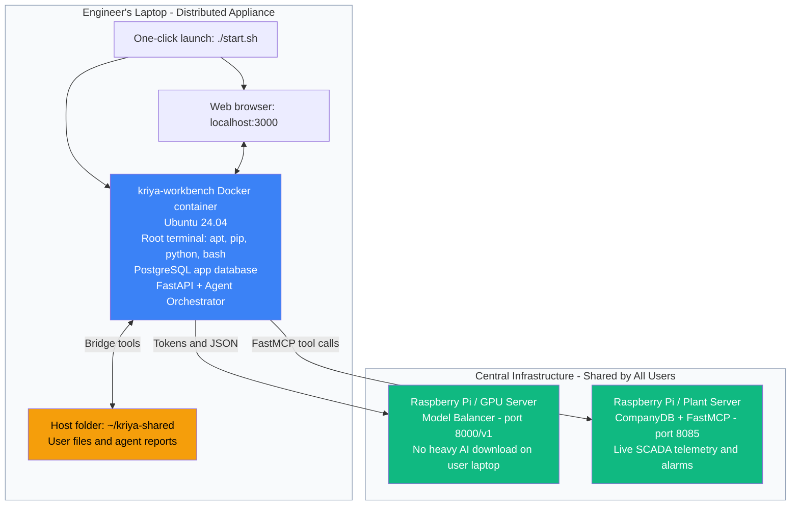

> see there is nothing like options anyhow we can give it n numbers of tools even if it have terminal tool,

  The thing is I am thinking of keeping entire Application inside the docker container itself and one click installation instead of login based container we put all files into the docker and one click
  installation, when user opens app it opens up in browser directly because the shell automation script will run the frontend and agent main harness and quicky opens up in browser. then login and use so
  here we are literally keeping the agent itself inside the contianer OS no need to change the current code.

  I mean it's done this is the first version we have which could do something atleast before we make more features lets deploy and make it a proper app

  but first of all the backend part is concerning what do you think right now we have to take the application database out of the current backend folder and make a another backend folder and put the database codes and initializations in it
  then rename the current backend folder as agent-harness, but I am thinkning is there anything else I need to include?
  

    Here is what is happening right now:

> /plan Hey you fool I said the client app must be inside the docker, Omg that means you gave full stuff to backend... holy shit... I said client in Docker container OS, the have
  nothing to do with the docker OS it just handles and routes the DB requests and model requests the entire agent and docker OS is with the user and the blob stoareges.

  do one thing eliminate the db calls from backend let the backend only routes to model balancer and the credentials + login and employee details part..

  we will make the conversations storage within client app that mean docker container OS. Just like how you work the AntigraviryCLI, same way this will work, so whom ever gets login the
  chats are going to be same nothing to do with it

  client app frontend and agent harness completely put that code into docker OS, then backend for login credentials otps etc etc, and remiaining two piecces wil do theit job